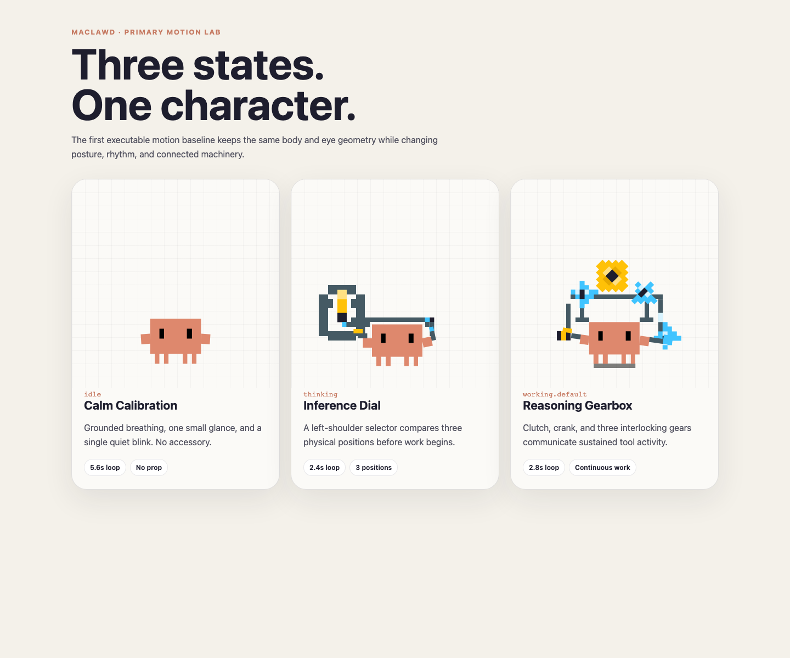
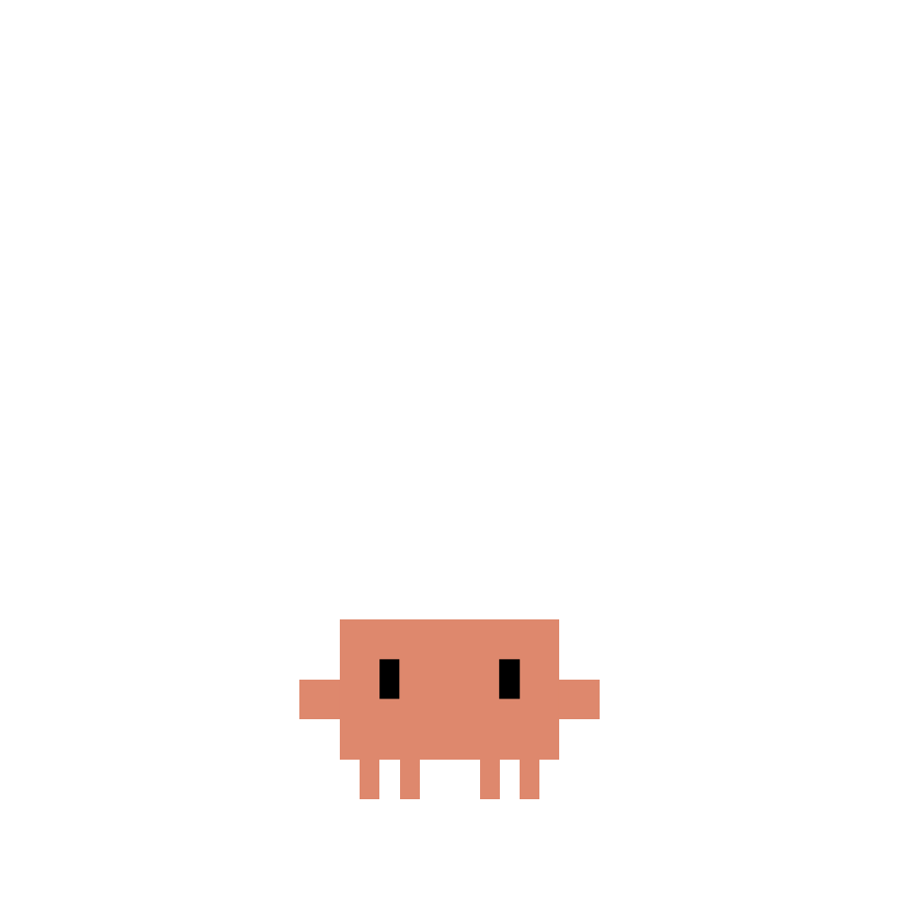
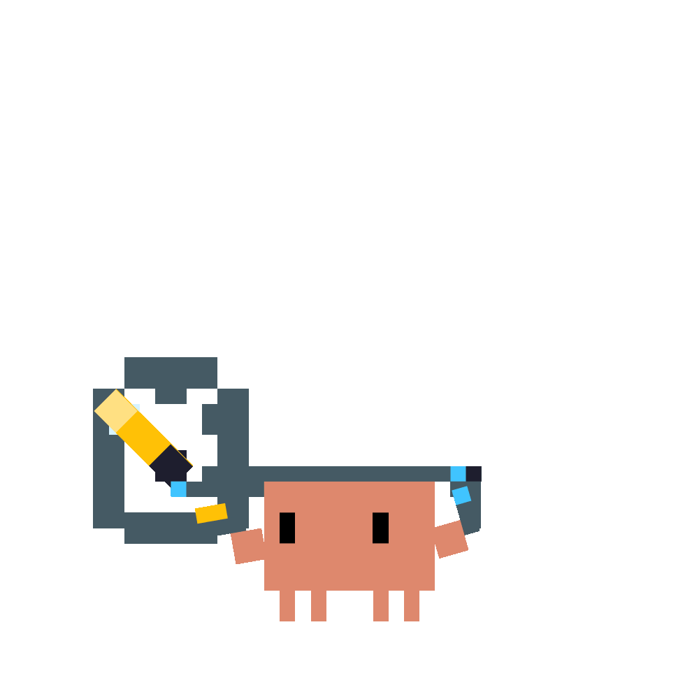
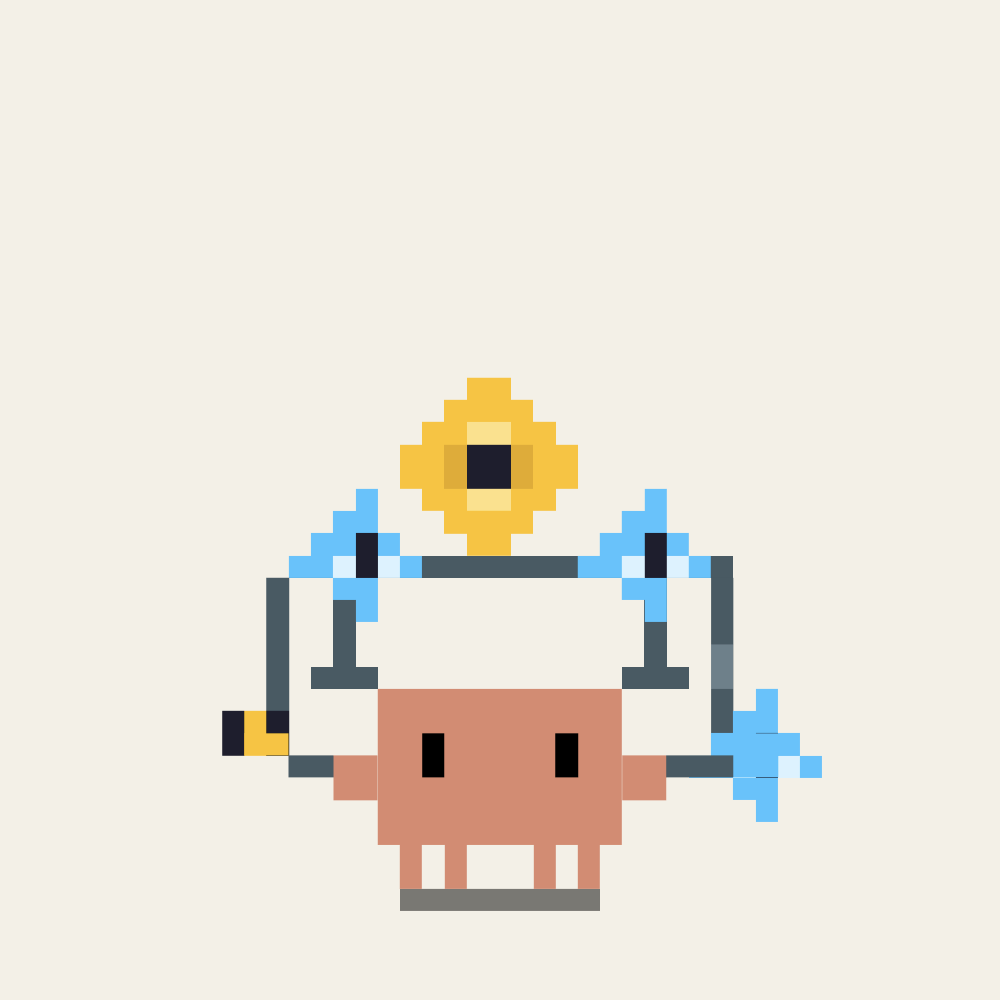

  

<h1 align="center">Maclawd</h1>

<strong>Clawd has moved into your Mac.</strong>

  An original Mac desktop companion built around new accessories, actions,
  interactions, and system behavior.

> [!IMPORTANT]
> Maclawd is at the first-design checkpoint. There is no downloadable macOS
> application yet.

## What we are building

Maclawd is planned as a complete Mac product:

- original animated actions for work, rest, attention, success, and errors
- a new accessory for every action group
- live reactions to AI-agent activity
- Mac desktop, menu bar, notification, and settings behavior
- independent product identity, icon, packaging, update flow, and release system
- a signed and notarized universal macOS application

## First executable motion baseline

The first three implemented states keep the locked Clawd body and eye geometry
while changing posture, rhythm, and connected machinery:

- `idle` — **Calm Calibration**, a 5.6-second accessory-free breathing loop
- `thinking` — **Inference Dial**, a 2.4-second three-position selector loop
- `working.default` — **Reasoning Gearbox**, a 2.8-second clutch-and-crank loop

| `idle` | `thinking` | `working.default` |
| --- | --- | --- |
|  |  |  |

[Open Idle](src/animations/calm-calibration.svg) ·
[Open Thinking](src/animations/inference-dial.svg) ·
[Open Working](src/animations/reasoning-gearbox.svg) ·
[Read the design contract](design/reasoning-gearbox.md) ·
[View the 96px identity check](previews/primary-motion-96px.png)

The complete twelve-state motion system is specified in
[`design/main-state-actions.md`](design/main-state-actions.md), with a matching
machine-readable contract in
[`design/main-state-actions.json`](design/main-state-actions.json).

## Repository status

This repository has an independent Git history and contains only Maclawd work.
The current checkpoint includes three animation sources, previews, the full
twelve-state design contract, browser motion lab, and development roadmap.

See [`PROGRESS.md`](PROGRESS.md) for completed work and the full build sequence.

## Preview locally

Open [`index.html`](index.html) in a browser. The preview has no build step and
loads the production SVG directly.

## Character notice

Clawd is the property of [Anthropic](https://www.anthropic.com). Maclawd is an
unofficial fan project and is not affiliated with or endorsed by Anthropic.

Unless stated otherwise, Maclawd project files are all rights reserved. See
[`LICENSE`](LICENSE).
