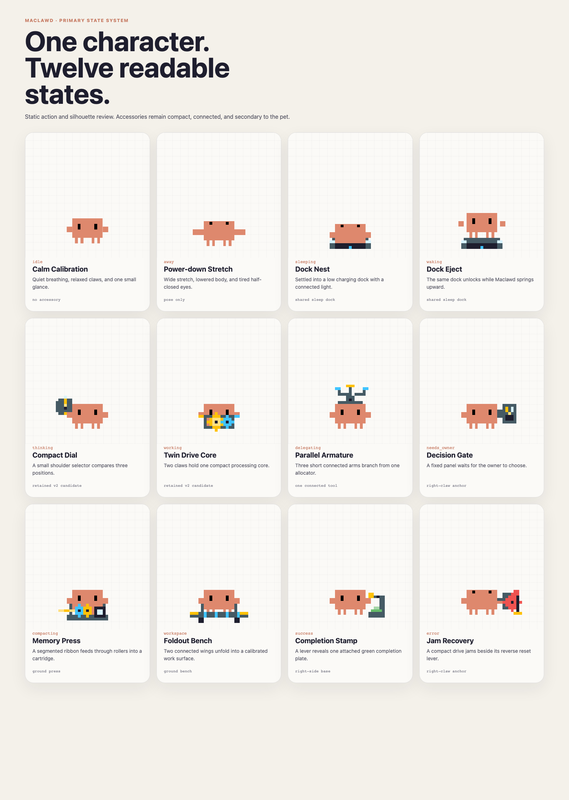

  

<h1 align="center">Maclawd</h1>

<strong>Clawd has moved into your Mac.</strong>

  An original Mac desktop companion built around new accessories, actions,
  interactions, and system behavior.

> [!IMPORTANT]
> Maclawd is at the first-design checkpoint. There is no downloadable macOS
> application yet.

## What we are building

Maclawd is planned as a complete Mac product:

- original animated actions for work, rest, attention, success, and errors
- contextual props only when they make the character's action more expressive
- live reactions to AI-agent activity
- Mac desktop, menu bar, notification, and settings behavior
- independent product identity, icon, packaging, update flow, and release system
- a signed and notarized universal macOS application

## Twelve-state static concept set

All primary states now have a compact action silhouette for review. The pet
remains the visual subject; every accessory is attached to a claw, shoulder
mount, or ground base.

| Row | States |
| --- | --- |
| Rest chain | `idle`, `away`, `sleeping`, `waking` |
| Agent activity | `thinking`, `working`, `delegating`, `needs_owner` |
| System feedback | `compacting`, `workspace`, `success`, `error` |

[Open the local review board](design/concepts/all-primary-states.html) ·
[View the 96px semantic check](previews/all-primary-states-96px.png) ·
[Read the concept notes](design/main-state-concepts.md)

These are static pose and accessory candidates. They do not claim that all
twelve CSS animations are complete.

### Playful v3 direction study

The next direction replaces persistent machinery with temporary domestic
metaphors and short visual gags. Its first four candidates are Shell Shuffle,
Token Knitting, Hatchling Parade, and Stuck Jar.

[Open the playful v3 review](design/concepts/playful-core-v3.html) ·
[Read the design rationale](design/playful-motion-direction-v3.md)

## First executable motion baseline

The first three implemented states keep the locked Clawd body and eye geometry
while changing posture, rhythm, and connected machinery:

- `idle` — **Calm Calibration**, a 5.6-second accessory-free breathing loop
- `thinking` — **Inference Dial**, a 2.4-second three-position selector loop
- `working.default` — **Reasoning Gearbox**, a 2.8-second clutch-and-crank loop

| `idle` | `thinking` | `working.default` |
| --- | --- | --- |
|  |  |  |

[Open Idle](src/animations/calm-calibration.svg) ·
[Open Thinking](src/animations/inference-dial.svg) ·
[Open Working](src/animations/reasoning-gearbox.svg) ·
[Read the design contract](design/reasoning-gearbox.md) ·
[View the 96px identity check](previews/primary-motion-96px.png)

The complete twelve-state motion system is specified in
[`design/main-state-actions.md`](design/main-state-actions.md), with a matching
machine-readable contract in
[`design/main-state-actions.json`](design/main-state-actions.json).

## Repository status

This repository has an independent Git history and contains only Maclawd work.
The current checkpoint includes three earlier animation sources, the complete
twelve-state static concept set, previews, the full design contract, browser
motion lab, and development roadmap.

See [`PROGRESS.md`](PROGRESS.md) for completed work and the full build sequence.

## Preview locally

Open [`index.html`](index.html) in a browser. The preview has no build step and
loads the production SVG directly.

## Character notice

Clawd is the property of [Anthropic](https://www.anthropic.com). Maclawd is an
unofficial fan project and is not affiliated with or endorsed by Anthropic.

Unless stated otherwise, Maclawd project files are all rights reserved. See
[`LICENSE`](LICENSE).
