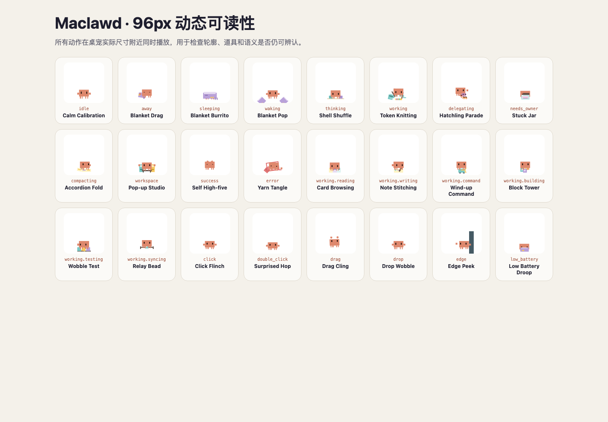
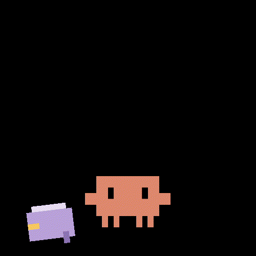
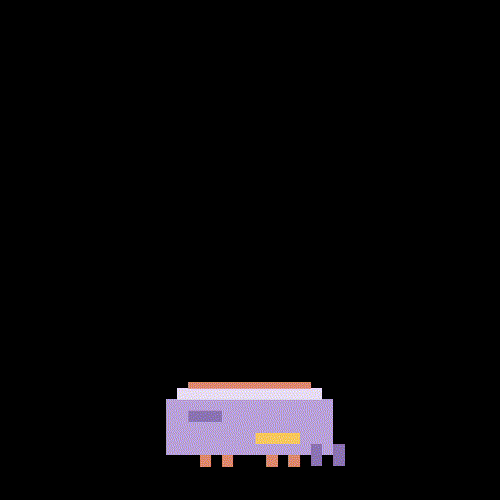
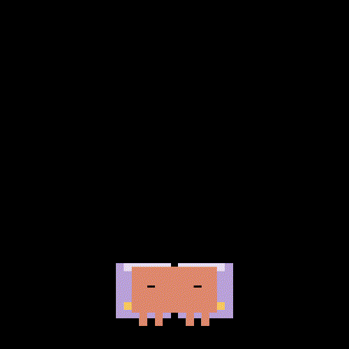
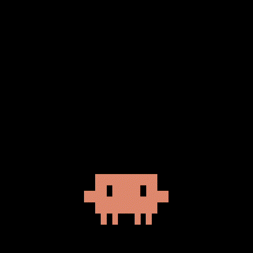

  

<h1 align="center">Maclawd</h1>

<strong>Clawd has moved into your Mac.</strong>

  An original Mac desktop companion built around new accessories, actions,
  interactions, and system behavior.

> [!IMPORTANT]
> Maclawd has completed its first full motion-design checkpoint. There is no downloadable macOS
> application yet.

## What we are building

Maclawd is planned as a complete Mac product:

- original animated actions for work, rest, attention, success, and errors
- contextual props only when they make the character's action more expressive
- live reactions to AI-agent activity
- Mac desktop, menu bar, notification, and settings behavior
- independent product identity, icon, packaging, update flow, and release system
- a signed and notarized universal macOS application

## Complete 24-action motion set

The first full SVG/CSS action system is implemented. The body, claws, legs,
eyes, coordinates, and base colors remain identical in every file; only poses,
temporary props, and discrete animation change.

| Layer | Count | Purpose |
| --- | ---: | --- |
| Primary states | 12 | Rest, Agent activity, owner attention, system feedback |
| Working modifiers | 6 | Reading, writing, command, building, testing, syncing |
| Interactions and ambient actions | 6 | Click, double click, drag, drop, edge peek, low battery |

[Open the live motion lab](index.html) ·
[View the complete 96px check](previews/all-actions-96px.png) ·
[Read the primary-state contract](design/main-state-actions.md) ·
[Read working modifiers](design/activity-modifiers.md) ·
[Read interactions](design/interaction-actions.md) ·
[Read animation QA](design/animation-qa.md)

### Primary states

| `away` | `sleeping` | `waking` | `success` |
| --- | --- | --- | --- |
|  |  |  |  |
| Blanket Drag | Blanket Burrito | Blanket Pop | Self High-five |

The sleep chain deliberately reuses one blanket, so `away → sleeping → waking`
reads as a continuous story. The other new primary actions are **Accordion
Fold**, **Pop-up Studio**, and **Yarn Tangle**. The approved earlier actions—
**Calm Calibration**, **Shell Shuffle**, **Token Knitting**, **Hatchling
Parade**, and **Stuck Jar**—remain unchanged.

### Working modifiers and interactions

Detailed activities are only shown when an external event can classify them
reliably. Generic busy activity always falls back to **Token Knitting**; the pet
never invents a task from an opaque Agent state. Interaction actions are driven
by the Mac app's own input and system events and do not require Agent internals.

## Earlier executable motion baseline

These sources remain available for design history. `idle` stays current;
Inference Dial and Reasoning Gearbox have been superseded by the playful group:

- `idle` — **Calm Calibration**, a 5.6-second accessory-free breathing loop
- `thinking` — **Inference Dial**, a 2.4-second three-position selector loop
- `working.default` — **Reasoning Gearbox**, a 2.8-second clutch-and-crank loop

| `idle` | `thinking` | `working.default` |
| --- | --- | --- |
|  |  |  |

[Open Idle](src/animations/calm-calibration.svg) ·
[Open Thinking](src/animations/inference-dial.svg) ·
[Open Working](src/animations/reasoning-gearbox.svg) ·
[Read the design contract](design/reasoning-gearbox.md) ·
[View the 96px identity check](previews/primary-motion-96px.png)

The complete twelve-state motion system is specified in
[`design/main-state-actions.md`](design/main-state-actions.md), with a matching
machine-readable contract in
[`design/main-state-actions.json`](design/main-state-actions.json).

## Repository status

This repository has an independent Git history and contains only Maclawd work.
The current checkpoint includes 24 active animations, two retained mechanical
prototypes, individual GIF/contact-sheet previews, a complete 96px review board,
machine-readable state maps, the browser motion lab, and the development roadmap.

See [`PROGRESS.md`](PROGRESS.md) for completed work and the full build sequence.

## Preview locally

Open [`index.html`](index.html) in a browser. The preview has no build step and
loads the production SVG directly.

## Character notice

Clawd is the property of [Anthropic](https://www.anthropic.com). Maclawd is an
unofficial fan project and is not affiliated with or endorsed by Anthropic.

Unless stated otherwise, Maclawd project files are all rights reserved. See
[`LICENSE`](LICENSE).
