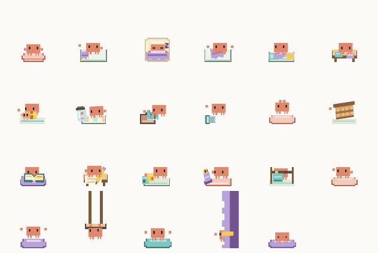
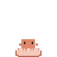
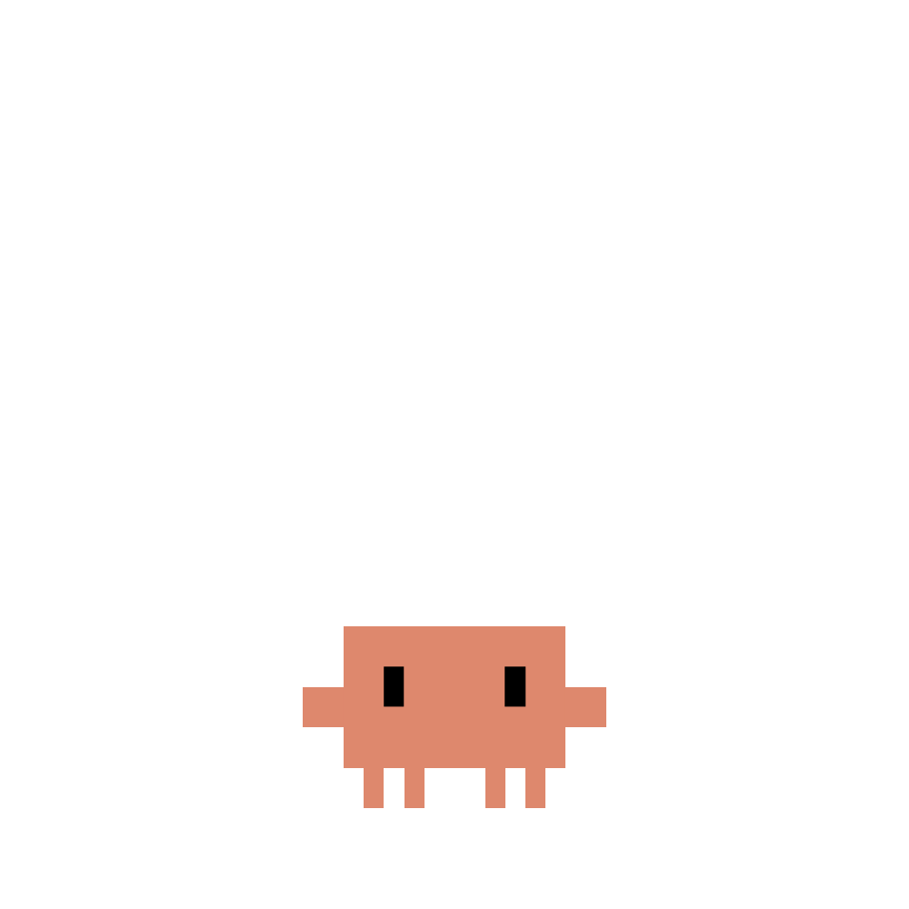
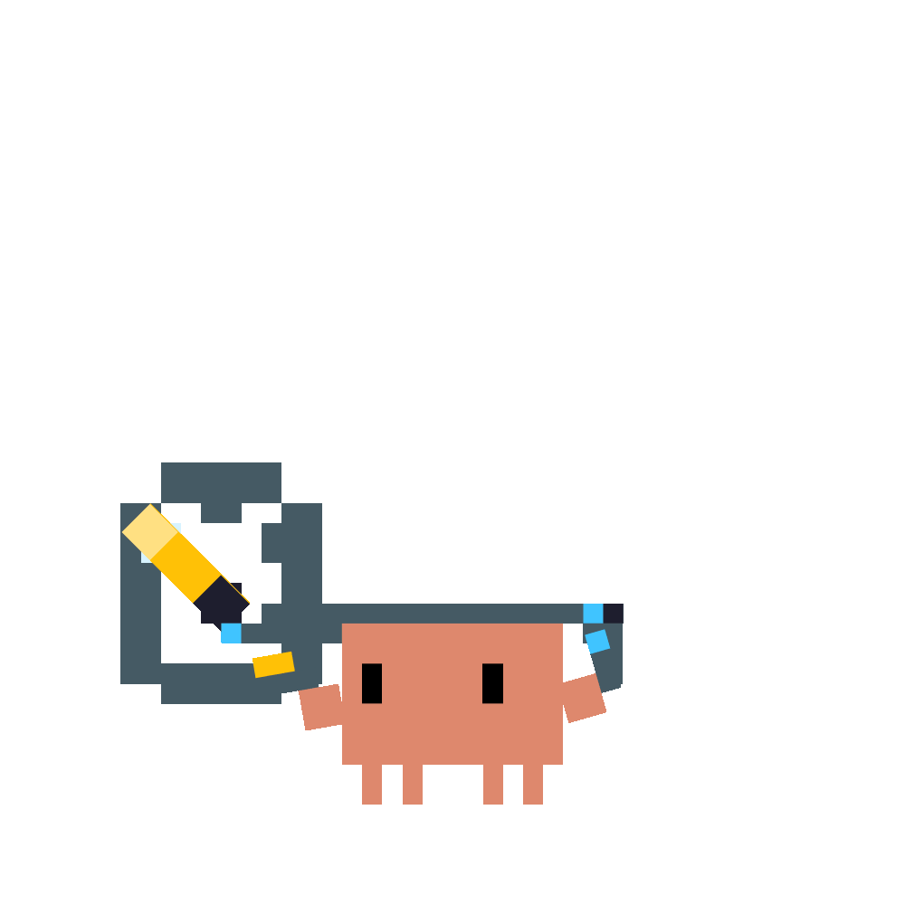
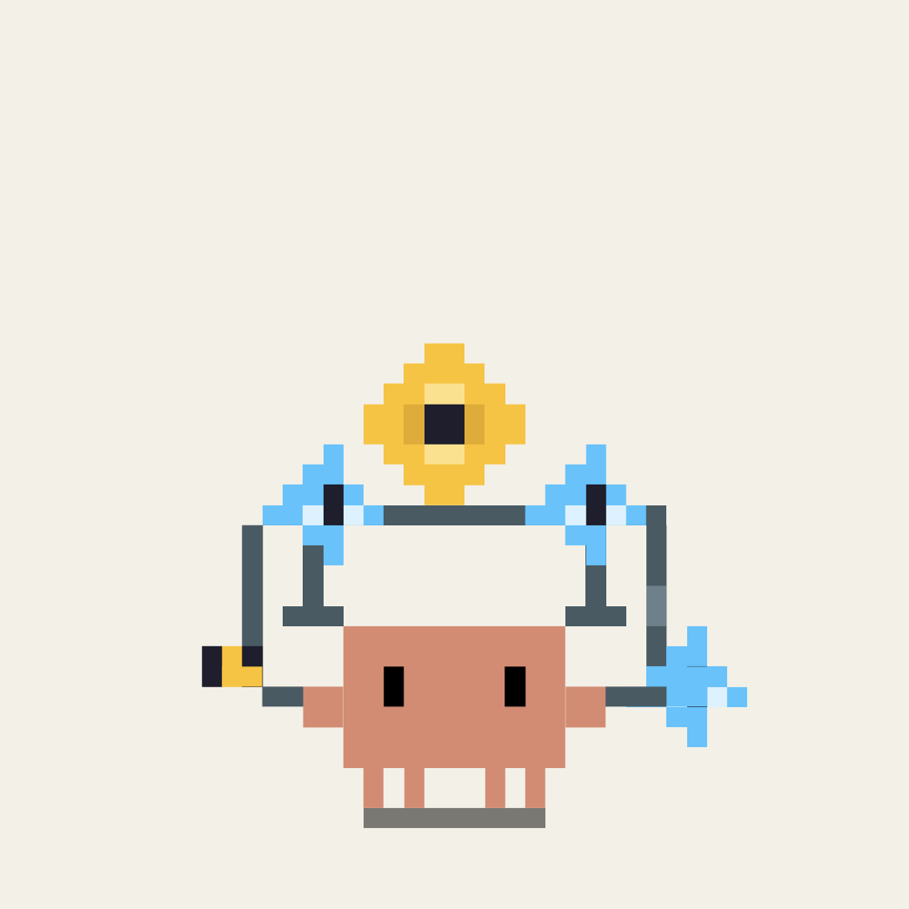

  

<h1 align="center">Maclawd</h1>

<strong>Clawd has moved into your Mac.</strong>

  An original Mac desktop companion built around new accessories, actions,
  interactions, and system behavior.

> [!IMPORTANT]
> Maclawd has completed its first full motion-design checkpoint. There is no downloadable macOS
> application yet. The current V5.4 checkpoint is a complete body-first motion design system.

## What we are building

Maclawd is planned as a complete Mac product:

- original animated actions for work, rest, attention, success, and errors
- contextual props only when they make the character's action more expressive
- live reactions to AI-agent activity
- Mac desktop, menu bar, notification, and settings behavior
- one-click local installation of the bundled Maclawd animation pack as a Codex custom pet
- independent product identity, icon, packaging, update flow, and release system
- a signed and notarized universal macOS application

## Complete 38-action motion set

The first full SVG/CSS action system is implemented. The body, claws, legs,
eyes, coordinates, and base colors remain identical in every file; only poses,
temporary props, and discrete animation change.

| Layer | Count | Purpose |
| --- | ---: | --- |
| Primary states | 12 | Rest, Agent activity, owner attention, system feedback |
| Working modifiers | 5 | Reading, writing, building, testing, syncing |
| Interactions and ambient actions | 6 | Click, double click, drag, drop, edge peek, low battery |
| Runtime lifecycle | 8 | Launch, quit, move, wait, pause, cancel, resolve, recover |
| Idle and environment additions | 7 | Groom, shuffle, drowse, hover, notification, offline, reconnect |

[Open the live motion lab](index.html) ·
[View the complete 96px check](previews/all-actions-v5-96px.png) ·
[View the 64px check](previews/all-actions-v5-64px.png) ·
[Read the primary-state contract](design/main-state-actions.md) ·
[Read working modifiers](design/activity-modifiers.md) ·
[Read interactions](design/interaction-actions.md) ·
[Read lifecycle and ambient actions](design/runtime-lifecycle-actions.md) ·
[Read animation QA](design/animation-qa.md)

### Primary states

| `away` | `sleeping` | `waking` | `success` |
| --- | --- | --- | --- |
|  |  |  |  |
| Blanket Tug | Top-down Sleep | Morning Stretch | Self High-five |

The sleep chain deliberately reuses one blanket, so `away → sleeping → waking`
reads as a continuous story. The sleep loop uses a top-down pillow, blanket,
closed-eye, and pixel-Zzz composition with no mattress or bottom pad. V5.3 is
body-first throughout: no rugs, desks, paths, cushions, floor strips, hanging
bars, mattresses, or full-scene bases. Small props overlap the body, attach to
one side, or stack vertically in **Puzzle Turn**, **Tile Stack**, **Parcel Stack**,
**Stuck Jar**, **Suitcase Fold**, **Workspace Folder**, and **Basket Rescue**.

### Working modifiers and interactions

Detailed activities are only shown when an external event can classify them
reliably. Generic busy activity always falls back to **Tile Stack**; `command`
is an alias of that generic state rather than a sixth prop animation. The pet
never invents a task from an opaque Agent state. Interaction actions are driven
by the Mac app's own input and system events and do not require Agent internals.

### Runtime lifecycle and a more alive idle

Eight body-led actions now cover the product lifecycle: **Hello Unfold**,
**Goodbye Tuck**, **Sideways Scuttle**, **Claw Tap Wait**, **Statue Pause**,
**Tiny Shrug**, **Jar Click**, and **Basket Breakout**. The last two deliberately
close the stories begun by `needs_owner` and `error` instead of cutting straight
back to idle.

Three low-frequency idle variants—**Claw Groom**, **Leg Shuffle**, and **Drowsy
Nod**—keep Quiet Watch as the default while preventing the pet from feeling
mechanically repetitive. **Cursor Gaze**, **Attention Turn**, **Signal Listen**,
and **Ready Wiggle** respond only to events the Mac app can actually observe.
`ambient.power_connected` reuses **Morning Stretch**, because energy returning is
already readable without adding a charger prop.

## Earlier executable motion baseline

These previews remain available for design history. The old accessory-free idle,
Inference Dial, and Reasoning Gearbox have all been superseded by V5:

- `idle` — **Calm Calibration**, a 5.6-second accessory-free breathing loop
- `thinking` — **Inference Dial**, a 2.4-second three-position selector loop
- `working.default` — **Reasoning Gearbox**, a 2.8-second clutch-and-crank loop

| `idle` | `thinking` | `working.default` |
| --- | --- | --- |
|  |  |  |

[Open current Quiet Watch](src/animations/calm-calibration.svg) ·
[Open Thinking](src/animations/inference-dial.svg) ·
[Open Working](src/animations/reasoning-gearbox.svg) ·
[Read the design contract](design/reasoning-gearbox.md) ·
[View the 96px identity check](previews/primary-motion-96px.png)

The complete twelve-state motion system is specified in
[`design/main-state-actions.md`](design/main-state-actions.md), with a matching
machine-readable contract in
[`design/main-state-actions.json`](design/main-state-actions.json).

## Repository status

This repository has an independent Git history and contains only Maclawd work.
The current checkpoint includes 38 active animations, one historical command
compatibility entry, two retained mechanical prototypes, individual GIF previews,
64px and 96px review boards,
machine-readable state maps, the browser motion lab, and the development roadmap.

See [`PROGRESS.md`](PROGRESS.md) for completed work and the full build sequence.

## Preview locally

Open [`index.html`](index.html) in a browser. The preview has no build step and
loads the production SVG directly.

## Use Maclawd as a Codex pet

Open the Maclawd panel, choose **Settings**, and select **一键安装到 Codex**.
Maclawd validates its bundled v2 sprite atlas, then installs only that package at
`~/.codex/pets/maclawd`. If another Maclawd version is present, the app asks before
replacing it; an unrelated directory at the same path is never overwritten. Refresh
**Codex Settings → Pets** after installation and select Maclawd.

## 完全卸载 / Uninstall

Maclawd 以 DMG 拖装分发，没有安装器。直接把 `.app` 拖进废纸篓也不会破坏
任何工具——但会把 Maclawd 写进其他工具的配置条目留成死路径（Claude Code
状态行会因此消失）。所以推荐的顺序是**先收尾、再删除**：

**第 1 步 · 移除全部外部写入。** 打开面板 → 设置 → 数据 →
**移除全部外部写入**。这一步会（只针对 Maclawd 自己写入的条目）：

- 移除 Claude Code 的 hooks、权限通道，并卸载状态行——如果安装时串联了
  你原来的状态行，会把它原样还原；
- 移除 Codex 的 hooks 与权限通道（`~/.codex/hooks.json`）；
- 移除 WorkBuddy 的 hooks；
- 移除 `~/.codex/pets/maclawd` 宠物包（仅在它确实是 Maclawd 的包时）；
- 注销「登录时启动」，并关闭以上功能的全部开关。

从源码运行的用户可以用 CLI 完成同一件事：`node bin/maclawd-usage.js offboard`
（登录项请在系统设置 → 通用 → 登录项中移除）。

**第 2 步 · 删除应用。** 把 `Maclawd.app` 拖进废纸篓。

**第 3 步（可选）· 清理本机数据。** 以下内容刻意保留，确认不再需要后手动删除：

| 路径 | 内容 |
| --- | --- |
| `~/Library/Application Support/Maclawd/` | 设置、用量统计、会话租约、状态行备份 |
| `~/Library/Caches/Maclawd/` | 模型价格表缓存 |
| `~/Library/Preferences/ai.maclawd.desktop.plist` | 菜单栏显示密度、桌宠位置 |
| `~/.claude/settings.json.maclawd-backup` | 首次修改前的 Claude Code 配置备份 |
| `~/.codex/hooks.json.maclawd-backup` | 首次修改前的 Codex 配置备份 |

注意：第 3 步要在第 1 步**之后**做——状态行的还原依赖数据目录里的
备份文件（sidecar），先删数据目录会让你原来的状态行无法自动还原。

## Character notice

Clawd is the property of [Anthropic](https://www.anthropic.com). Maclawd is an
unofficial fan project and is not affiliated with or endorsed by Anthropic.

Unless stated otherwise, Maclawd project files are all rights reserved. See
[`LICENSE`](LICENSE).
